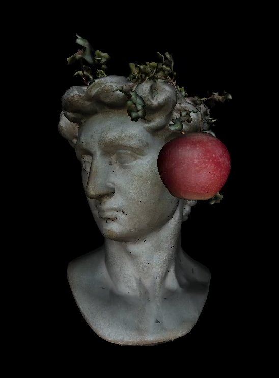
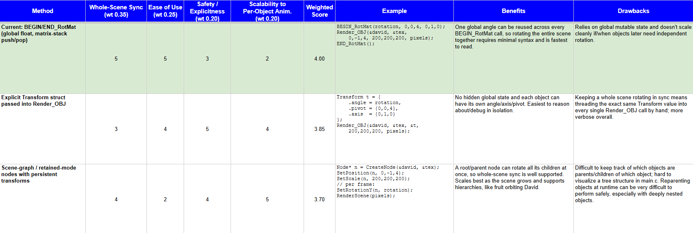

# CPU Software Rasterizer

## Demo:

 [Demo video (60 fps)](http://www.youtube.com/watch?v=lUOemYvbTUM)

*(Single frame)* 



## Overview

This project is a CPU-based software 3D renderer built from scratch in C, using SDL3 only for windowing and providing a pointer to the framebuffer, and using stb_image for PNG/JPEG texture decoding.

## Features

### Rendering Core

* Custom OBJ file parser (positions, normals, UVs, faces)
* Perspective-correct texture mapping via reciprocal-Z interpolation
* Incremental edge-function rasterization
* Z-buffered depth testing
* Backface culling via signed area/winding order, toggleable at runtime via `SetCullingMode()`
* Near-plane clipping
* Scale → Rotate → Translate (SRT) object transform pipeline
### Lighting

* Directional lighting model with ambient term
* Per-pixel interpolated normals for smooth shading
### Math Library

* Custom quaternion math (multiply, add, scale, dot product)
* Quaternion-to-rotation-matrix conversion
* Custom Vec3 operations (normalize, dot product)
### Transform System

* Scoped `BEGIN_RotMat` / `END_RotMat` blocks for applying a shared rotation to multiple objects at once
* Arbitrary axis-angle rotation around any pivot point
### 2D Drawing Primitives

* Pixel, line, rectangle, and circle drawing directly into the framebuffer
* Adjustable-thickness line drawing (DDA-based)
* Scanline-based circle fill (no per-pixel distance check)
### Windowing & Frame Pipeline

* Manual framebuffer management (custom pixel array, avoiding SDL's draw calls)
* Manual resource lifecycle management for loaded OBJs and textures
* Frame-independent motion via delta time
* Streaming GPU texture upload each frame
* PNG/JPEG texture loading via stb_image


(Resolution and other constants (e.g. max triangle count) are defined once in `config.h`, so adjusting screen size doesn't require touching rendering, buffer, or windowing code elsewhere.)

## How It Works
### Rendering Pipeline

1. **Collect triangle data from each .obj**
	- Builds an array of Triangle structs, with each struct holding 3 vertices with position/UV/normal
2. **Transform triangles into screen space**
	- Take the loaded triangles, and apply scale, rotation, then translation, then project the triangles into screen coordinates
3. **Figure out which pixels on screen the triangle covers**
	- Compute the bounding box for each triangle, then walks pixel-by-pixel using an incremental edge function to figure out which pixels are inside the triangle
4. **For each covered pixel, find the corresponding texture pixel**
	- Perform perspective-correct interpolation of the UV coordinates at that pixel via barycentric weights, then indexes into the texture's `ARGB[]` array to grab the raw color
5. **Multiply that color by the lighting value**
	- Compute brightness from the interpolated normal and the light direction, combines it with ambient light, then multiplies the texture pixel color by this brightness value
6. **Write the final color to the framebuffer**
	- Write into the frame buffer `pixels[y * WIDTH + x] = lighted_ARGB`, but only if the pixel passes the Z-buffer depth test
7. **Flip the framebuffer in memory to the screen**
	- Once every object's triangles have been rasterized into `pixels[]` for that frame, upload the GPU texture and call `SDL_RenderPresent` to display it into the window


## Tech Stack

- **C**
- **SDL3** (used to open a window and blit a raw pixel buffer to the screen. No SDL draw calls; the renderer writes directly into a self-owned C array that's handed to SDL as a pointer each frame)
- **stb_image** (PNG/JPEG texture decoding)

## How to Build and Run

### 1. Clone the repository

```bash
git clone https://github.com/yourusername/framebuffer.git
cd framebuffer
```

### 2. Install the SDL3 development libraries

This project requires the **SDL3 3.4.8** development package.

Download it from:

https://github.com/libsdl-org/SDL/releases/tag/release-3.4.8

Extract the archive and copy the contents of the `x86_64-w64-mingw32/` folder into a new `SDL3/` directory at the project root so the project structure looks like:

```text
SDL3/
├── bin/
├── include/
└── lib/
```

### 3. Build the program

**Option 1 (recommended): Using Make**

Run this from the project root. It compiles the project and automatically copies `SDL3.dll` into the executable directory.

```bash
make
```

**Option 2: Using GCC directly**

Run this from the `src/` folder:

```bash
gcc main.c draw2d.c draw3d.c lighting.c obj_loader.c quaternion_operations.c sdlmanager.c vector_operations.c -o ../demo -I ../SDL3/include -L ../SDL3/lib -lSDL3 -lm
```

Then copy the SDL3 runtime DLL manually:

```bash
copy ..\SDL3\bin\SDL3.dll ..\
```

Return to the project root:

```bash
cd ..
```

### 4. Run the program

```bash
./demo
```

## Requirements

- GCC or Clang
- SDL3 3.4.8 development libraries


## Challenges & What I Learned

### The Problem:
* I noticed [texture swimming](https://www.youtube.com/watch?v=VN6csuQ4Grk) *(via TheKerchmar)* on the models I was trying to render. When interpolating UV coordinates across each triangle, I had not accounted for the fact that UV coordinates do not interpolate linearly across a perspective-correct surface. This is because points further from the camera appear smaller and are shifted toward the origin (center). If a point close to the camera corresponds to UV (0,0), and a point further away corresponds to UV (1,1), a point halfway between them in screen space would be closer to UV (0,0) than UV (1,1). Simply, far objects are compressed into fewer pixels. 

### The Solution: 
**Perspective-correct texture mapping**.
- When we divide vertex positions by `z` to get proper perspective, we lose the linear relationship between screen pixels and UV position. So, instead of interpolating `u` and `v` directly, I interpolate `u/z`, `v/z`, and `1/z` across the triangle, which do vary linearly in screen space. To recover the perspective-correct UV at each pixel, we can solve for `u` in `u = (u/z) / (1/z)`. Linear interpolation only works if that variable actually varies linearly with screen position in the first place.

### The Problem:
- How should we require the user of this rasterizer to rotate objects? There were 3 common options I chose to weigh, and I did so in this weighted decision matrix:



I figured the global matrix would be the best option.

## Future Improvements:

- Explicit camera controls would be helpful for building games or exploring 3D models
- Point light sources rather than only directional light sources allow users to create more complex/realistically lighted scenes
- Add support for other 3D model formats, such as glTF, FBX, and STL
- Add support for more 2D design elements, such as images or embedded videos to give users more freedom to build HUDs or GUIs within their projects

## Credits / Assets Used:

"Banana – Photorealistic Fruit Asset" by ARTEL_3D, available on Sketchfab: [Link to model page](https://sketchfab.com/3d-models/banana-photorealistic-fruit-asset-ac3998e6b0364ef393aaf0b8c281a2d2). Licensed under Creative Commons Attribution (CC BY). No changes were made.

"Head of David but with hay" by doubletwisted, available on Sketchfab: [Link to model page](https://sketchfab.com/3d-models/head-of-david-but-with-hay-585af747e89f4e78afda322c487a5059). Licensed under Creative Commons Attribution (CC BY). Modified by decimating the mesh.

"Red Apple – Realistic Fruit Asset" by ARTEL_3D, available on Sketchfab: [Link to model page](https://sketchfab.com/3d-models/red-apple-realistic-fruit-asset-88bb1dd112f84b3faae05a80531e1bd5). Licensed under Creative Commons Attribution (CC BY). No changes were made.